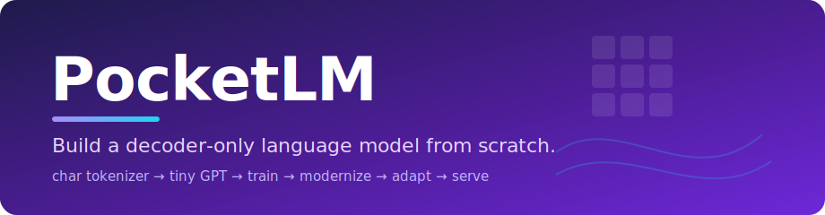
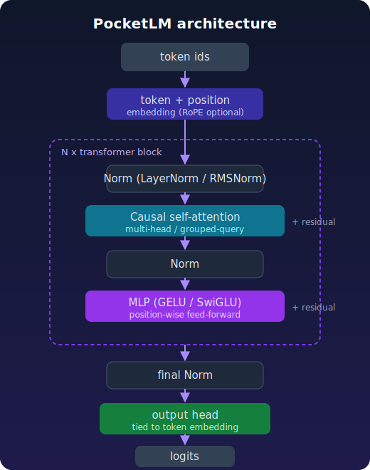
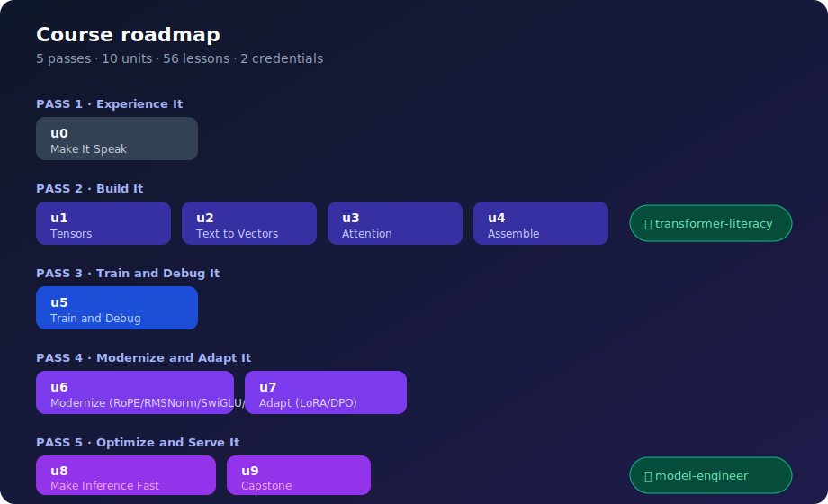

<p align="center">
  
</p>

<p align="center">
  <a href="https://github.com/ni5h4nt/pocketlm/actions/workflows/ci.yml"></a>
  
  
  
  
</p>

# PocketLM

**PocketLM is a complete, hands-on course that takes you from "what is a token?" to building, training, modernizing, fine-tuning, optimizing, and serving your own decoder-only language model, the same architecture family as GPT and Llama, shrunk small enough to train in seconds on a laptop CPU.**

You write every piece yourself, guided by 56 runnable notebooks. The code you build up lives in a tiny, tested, pip-installable Python package (`pocketlm`); the notebooks only *drive* it. Nothing is a black box, and nothing needs a GPU.

You can learn it **standalone** (this repo) **or via [cybertect](https://github.com/ni5h4nt)** (the course platform that hosts these same notebooks). Either way the engine is identical.

---

## Why this exists

Most "build a transformer" tutorials stop at a working forward pass. Real model engineering is the rest: training dynamics, modern architecture choices, parameter-efficient fine-tuning, quantization, KV caching, serving. PocketLM walks the **whole** pipeline, at a scale you can actually run and inspect, so the ideas stick.

- **Newbie to expert.** Early lessons assume you have never touched PyTorch. Later ones cover RoPE, GQA, LoRA/QLoRA, DPO, paged attention, and speculative decoding.
- **Everything runs.** Every notebook executes end to end in CI (`pytest --nbmake`) and in Colab. Each ends in an assertion, so a broken concept fails loudly.
- **Tiny by design.** A `micro` config trains and generates in seconds on a CPU. The architecture is faithful to production LLMs; only the size is small.

---

## What you'll build

<p align="center">
  
</p>

By the end, the `pocketlm` package contains a real (if tiny) language-model stack that *you* assembled lesson by lesson:

| Area | What you build |
|---|---|
| **Tokenization** | a char tokenizer and a byte-level **BPE** tokenizer |
| **Model** | a config-driven decoder-only transformer: causal multi-head / **grouped-query** attention, residual stream, pre-norm (**LayerNorm/RMSNorm**), **GELU/SwiGLU** MLP, learned / **RoPE** positions, weight tying |
| **Training** | a train loop, init schemes, AdamW, warmup + cosine LR, train/val splits, perplexity, checkpoint/resume |
| **Adaptation** | **LoRA** adapters, a **DPO** preference loss, fake quantization (QLoRA idea) |
| **Inference** | a **KV cache** (parity-proven), and an `InferenceService` you can put behind FastAPI |

---

## Course structure

The course is 5 **passes**, 10 **units**, 56 **lessons**, and 2 **credentials**. A pass is a milestone; a credential marks a complete, employable skill set.

<p align="center">
  
</p>

| Pass | Theme | Units | Lessons | Credential at the end |
|---|---|---|---|---|
| **1** | Experience It | u0 | 5 | (none) |
| **2** | Build It | u1-u4 | 22 | 🎓 **transformer-literacy** |
| **3** | Train and Debug It | u5 | 7 | (none) |
| **4** | Modernize and Adapt It | u6-u7 | 14 | (none) |
| **5** | Optimize and Serve It | u8-u9 | 8 | 🎓 **model-engineer** |

Lessons are cumulative: each one advances the single PocketLM artifact you carry from u0 to the capstone.

<details>
<summary><b>Full lesson index (all 56)</b></summary>

### u0 · Make It Speak
`l0.1` Generate text · `l0.2` Tokens · `l0.3` Probabilities · `l0.4` Temperature and decoding · `l0.5` Break generation

### u1 · Tensors That Learn
`l1.1` Tensors and shapes · `l1.2` Matrix multiplication · `l1.3` Softmax · `l1.4` Cross-entropy · `l1.5` Gradients and autograd · `l1.6` Optimization loop

### u2 · Text Becomes Vectors
`l2.1` Characters as tokens · `l2.2` Bytes and byte-level BPE · `l2.3` Vocabulary design · `l2.4` Embeddings · `l2.5` Positional information · `l2.6` Batching and padding

### u3 · Attention From Scratch
`l3.1` Queries keys and values · `l3.2` Scaled dot-product · `l3.3` Causal masking · `l3.4` Multi-head attention · `l3.5` Shape tracing and tests

### u4 · Assemble the Transformer
`l4.1` Residual stream · `l4.2` Pre-normalization · `l4.3` MLP feed-forward · `l4.4` Transformer block · `l4.5` Output head and weight tying

### u5 · Train and Debug It
`l5.1` Initialization · `l5.2` Optimizers · `l5.3` Learning-rate schedules · `l5.4` Dataset splits · `l5.5` Over- and underfitting · `l5.6` Perplexity and evaluation · `l5.7` Checkpointing and resume

### u6 · Modernize the Architecture
`l6.1` RoPE · `l6.2` RMSNorm · `l6.3` SwiGLU · `l6.4` GQA/MQA · `l6.5` FlashAttention · `l6.6` Scaling laws · `l6.7` MoE introduction · `l6.8` Ablation harness

### u7 · Adapt and Post-Train
`l7.1` Base vs instruction models · `l7.2` SFT · `l7.3` LoRA · `l7.4` QLoRA · `l7.5` Preference optimization · `l7.6` Data quality and eval card

### u8 · Make Inference Fast
`l8.1` KV caching · `l8.2` Memory accounting · `l8.3` Quantization · `l8.4` Continuous batching · `l8.5` Paged attention · `l8.6` Speculative decoding · `l8.7` Serve via inference API

### u9 · Model-Engineer Capstone
`l9.1` Capstone (build → train → adapt → optimize → serve, end to end)

</details>

---

## Quickstart

**In Colab (zero setup):** open any lesson via its Colab link, for example the first one:

```
https://colab.research.google.com/github/ni5h4nt/pocketlm/blob/main/lessons/u0-make-it-speak/l0-1-generate-text.ipynb
```

The notebook's first cell `pip install`s PocketLM (the training corpus ships inside the package), so Run All just works.

**Locally:**

```bash
git clone https://github.com/ni5h4nt/pocketlm
cd pocketlm
pip install -e ".[dev]"
jupyter lab lessons/u0-make-it-speak/l0-1-generate-text.ipynb
```

**Just the engine, in your own code:**

```python
from pocketlm import train_tiny, generate, load_corpus

model, tok = train_tiny(load_corpus())
print(generate(model, tok, "ROMEO:", max_new_tokens=200))
```

---

## The `pocketlm` package

Everything the notebooks build is importable and tested.

```python
from pocketlm import (
    CharTokenizer, BPETokenizer,            # tokenization
    BigramLM, PocketLM, PocketLMConfig,     # models
    scaled_dot_product_attention,           # attention primitive
    train_tiny, pick_config,                # training entry point + presets
    init_weights, cosine_lr, split_data,    # training toolkit
    estimate_loss, perplexity,
    save_checkpoint, load_checkpoint,
    generate, next_token_probs,             # sampling
    RMSNorm, SwiGLU, precompute_rope, apply_rope,   # modern components
    add_lora, dpo_loss, fake_quantize,      # post-training
    KVCache, cached_step, InferenceService, # inference
    load_corpus, corpus_path,               # bundled data
)
```

---

## Development

```bash
pip install -e ".[dev]"
ruff check .                                   # lint
mypy pocketlm                                  # type-check
pytest -q                                      # unit tests
POCKETLM_CI=1 pytest --nbmake lessons/ -q      # execute every notebook
nbqa ruff lessons/                             # lint notebooks
```

CI runs all of the above on every push. Notebook paths are validated against the cybertect `notebookPath()` convention by `tests/test_paths.py`, so Colab URLs always resolve.

**Corpus.** [Project Gutenberg eBook #100](https://www.gutenberg.org/files/100/100-0.txt) (public domain), a ~1 MB slice, shipped as package data. Provenance and how to rebuild: [`data/README.md`](data/README.md).

---

## License

MIT, © 2026 ni5h4nt. The course structure's source of truth is the manifest in cybertect; this repo mirrors it by convention.
